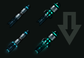
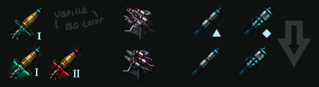
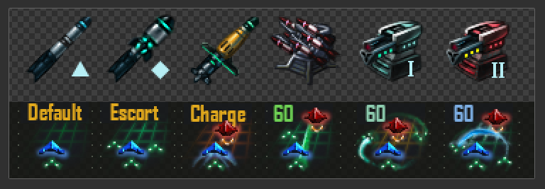

# Graphical changelog
Comparison pics and personal thoughts
## Comp2 - 4/3

### Torpedos
- Add glowing exhaust
    - Improves legibility and outline
    - Communicates weapon class: "glowing exhaust" visually implies "long range"

## Comp1 - 4/2

### General
- Increase outline contrast across the board
    - The vanilla in-game background color made the silhouettes weaker than designed
### Cruise Missiles
- Added second tier.
    - Red-gold coloration to match second tier BB cannon.
    - Not sure if its used in game currently but it sounded like Cap wanted one
- Added glow.
    - Extra contrast and UI presence to better suit end-game L class weapon significance.
    - Better communicates the physical design (goofy cruise winglet -> some kind of scifi photon sail or thruster)
### Missile PD
- Better identifiability with less-cluttered design
### Torpedos
- Removed ship symbols
    - I originally feared they looked too similar at a glance, but honestly it doesnt matter since they never appear on the menu together in-game.

## Shipbuilder icons uploaded to discord - 3/28

### Added
- Frigate and Capital ranged torpedos
- Large cruise missiles
- Harrington missile PD
- Battleship light cannons tier 1 and 2
- Ship combat behaviors

